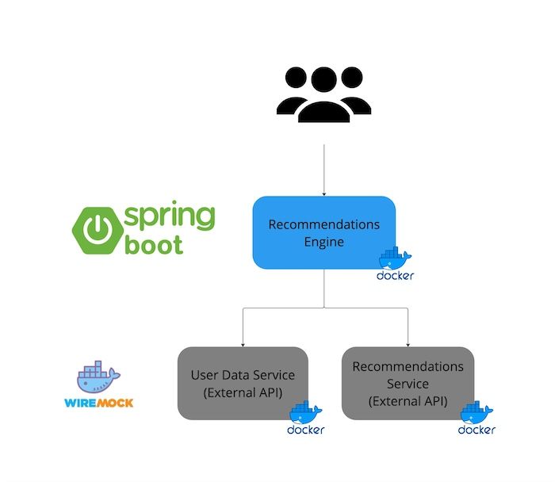

# ShipIt 59 - Using lightweight continuous integration approach with KITT / K8s

## Idea

Create a CI / CD pipeline that will create an ephemeral environment on each change and validate our change automatically (before merging it to the master branch), once it is merged it should be automatically deployed to the staging / pre-prod environment.

## Goals

- improve developer experience by providing a way to test the changes in a real environment before merging them to the master branch
- address the challenge of having a fast feedback loop for developers
- improve the developer experience and productivity by automating the validation of the changes
- leverage Kubernetes / Helm / KITT to create ephemeral environments for each PR
- have fun and do the project together / pair programming

## Team

[Alan Turower](https://directory.prod.atl-paas.net/employees/aturower)
[Artur Madaj](https://directory.prod.atl-paas.net/employees/amadaj)
[Bartosz Fudali](https://directory.prod.atl-paas.net/employees/bfudali)
[Lukasz Zachulski](https://directory.prod.atl-paas.net/employees/lzachulski)
[Tomasz Michalak](https://directory.prod.atl-paas.net/employees/tmichalak)

## Requirements

- [BitBucket Pipelines](https://support.atlassian.com/bitbucket-cloud/docs/get-started-with-bitbucket-pipelines/)
- [Docker](https://docs.docker.com/get-docker/)
- [Kubectl](https://kubernetes.io/docs/tasks/tools/install-kubectl/)
- [Helm](https://helm.sh/docs/intro/install/)
- [KIND](https://kind.sigs.k8s.io/docs/user/quick-start/)
- [Java 17](https://www.oracle.com/java/technologies/javase-jdk17-downloads.html)
- [Spring Boot](https://spring.io/projects/spring-boot)

## Architecture

## How to run

Run `./start.sh` script from `scripts` directory to setup the fully working environment with deployed applications.

## Contribution
Follow the [Contribution Guidelines](CONTRIBUTING.md)

## Refences
- [Miro board](https://miro.com/app/board/uXjVLdz5Ras=/)