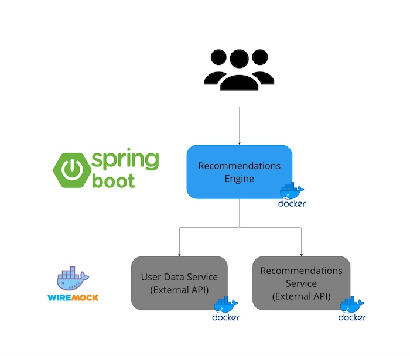

## Recommendations Engine
Internal service that provides recommendations for a user email. It is a Spring Boot application that returns a list of recommendations for a given user email.

[](assets/integration-logic.jpg)

### Runnning the application

For development purposes, you can run the all the external services locally as containers:

- [Users Service](../users-service/README.md)
- [Recommendations Service](../recommendations-service/README.md)


And then develop the Recommendations Engine service locally running the Spring Boot application:

```bash
mvn clean spring-boot:run
```

or from your IDE.

### Build

To build the application, run:

```bash
mvn clean package
docker build -t recommendations-engine:latest .
```

## Health Check

To see your applications health enter url `http://localhost:8080/actuator/health` in your browser.